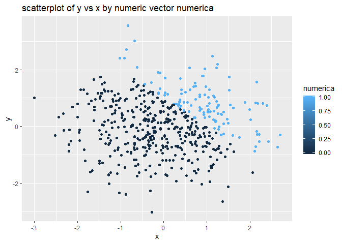

p8105\_hw1\_jt3174
================
Jingyi
9/16/2019

# Problem 1

#### Create a data frame comprised of:

##### \* a random sample size of 8 from a standard Normal distribution

##### \* a logical vector indicating whether elements of the sample are greater than 0

##### \* a character vector of length 8

##### \* a factor vector of length 8, with 3 different factor “levels”

``` r
# load the necessary 
library(tidyverse)
```

    ## -- Attaching packages ------------------------------------------------------------ tidyverse 1.2.1 --

    ## v ggplot2 3.2.1     v purrr   0.3.2
    ## v tibble  2.1.3     v dplyr   0.8.3
    ## v tidyr   0.8.3     v stringr 1.4.0
    ## v readr   1.3.1     v forcats 0.4.0

    ## -- Conflicts --------------------------------------------------------------- tidyverse_conflicts() --
    ## x dplyr::filter() masks stats::filter()
    ## x dplyr::lag()    masks stats::lag()

``` r
# ensure the reproducitivity
set.seed(1)

# Question: Is this set.seed() here necessary?
# Question: Can I just get any character/factor vector? Or something else is required?
# Question solved.

# create the dataframe for the first question
# the order of variables are as stated above

Part1Question1 = tibble(
  ramdomsamplex = rnorm(8),
  logicaly = ramdomsamplex > 0,
  characterz = c("rnorm1", "rnorm2", "rnorm3", "rnorm4", "rnorm5", "rnorm6", "rnorm7", "rnorm8"),
  factora = factor(c("level1", "level2","level3", "level1", "level2", "level3", "level1", "level2")))

# Question: Is this correct and am I on the right track?
# Question Solved.

# Now take the mean of each vector in the dataframe.

mean_ramdomsamplex = mean(pull(Part1Question1, ramdomsamplex))
mean_logicaly = mean(pull(Part1Question1, logicaly))
mean_characterz = mean(pull(Part1Question1, characterz))
```

    ## Warning in mean.default(pull(Part1Question1, characterz)): argument is not
    ## numeric or logical: returning NA

``` r
mean_factora = mean(pull(Part1Question1, factora))
```

    ## Warning in mean.default(pull(Part1Question1, factora)): argument is not
    ## numeric or logical: returning NA

``` r
# Now use the as.numeric function.
# Show the chuck but not the output.

 # Question: How do I keep both the name of the code chuck and the command together?
 # Question: What if I want to only hide the result of as.numeric part?
########################
# separate this part to hide the result but show the code chuck.

# Convert logical vector, character vector and factor vector into numeric vectors

numeric_logicaly = as.numeric(pull(Part1Question1, logicaly)) 
numeric_characterz = as.numeric(pull(Part1Question1, characterz))
```

    ## Warning: NAs introduced by coercion

``` r
numeric_factora = as.numeric(pull(Part1Question1, factora))
```

For the mean value finding part: factora and logicaly returned mean
values. For this part, the logical vector returned a mean value, it
seems like R took the logical vector False as 0 and then TRUE as 1. And
my calculation proves it. characterz and factora did not return a mean
value since characterz and factora are not numeric.

For the as.numeric part: All logicaly, characterz and factora values are
converted into numeric vectors and it seemed like logicaly and factora
are fine with this conversion; however, there are NA values introduced
in the dataset forcefully. characterz failed to have true values, but
NA’s. If we try further with its mean, we will also get NA as output.
This is because the character vector failed to convert into any numeric
values. However, factora converted and will also produce a mean if we
try further. This is because R assigned numeric values such as 1, 2, 3’s
to different levels according to the order of it; hence, we can also get
a mean after this forcefully transformation. Yes, this does explain what
happened when we are trying for mean function for the last part. R can’t
execuate mean function properly unless we have numerical values in the
dataset.

#### Now Part 2 of Question 1:

##### \* convert the logical vector to numeric, and multiply the random sample by the result

##### \* convert the logical vector to a factor, and multiply the random sample by the result

##### \* convert the logical vector to a factor and then convert the result to numeric, and multiply the random sample by the result

``` r
# For each converted to numeric vectors

# multiply the random sample by the result

numeric_logicaly_1 = numeric_logicaly * pull(Part1Question1, ramdomsamplex)
    # Question: What do the question mean by random sample by the result?

# convert the logical vector into factor vector
factor_logicaly = as.factor(pull(Part1Question1, logicaly))

####### ATTENTION #########

# multiply the random sample by the result

factor_logicaly_1 = factor_logicaly * pull(Part1Question1, ramdomsamplex)
```

    ## Warning in Ops.factor(factor_logicaly, pull(Part1Question1,
    ## ramdomsamplex)): '*' not meaningful for factors

``` r
###########################

# convert the logical vector to a factor and then convert the result to numeric, and multiply the random sample by the result

numeric_logicaly_2 = as.numeric(factor_logicaly_1)
numeric_logicaly_3 = numeric_logicaly_2 * pull(Part1Question1, ramdomsamplex)
```

For the factor\_logicaly part, it did not return a value, but the
massage said that \* is not operatable. What happened here is that the
factor\_logicaly is a factor vector and this vector cannot be multiple
with numeric vectors. Therefore, R cannot return any numeric values for
this part of code.

# Problem 2

#### Create a data frame comprised of:

##### \* x: a random sample of size 500 from a standard Normal distribution

##### \* y: a random sample of size 500 from a standard Normal distribution

##### \* A logical vector indicating whether x + y \> 1

##### \* A numeric vector created by coercing the above logical vector

##### \* A factor vector created by coercing the above logical vector

``` r
# ensure reprpductivity
set.seed(10)
# Question: Do I need another set.seed()?
# If I have a set.seed() here will it make x and y the same outputs?

# create the dataframe by the order stated above

Question2 = tibble(
  x = rnorm(500),
  y = rnorm(500),
  logicalz = x + y > 1,
  numerica = as.numeric(logicalz),
  factorb = as.factor(logicalz))

# Dataframe created.

# count the number of logicalz
zcount = pull(Question2, logicalz)
```

  - The size of the dataset are 500 rows and 5 columns.

  - The mean of x is -0.0108732.

  - The medium of x is -0.0212291.

  - The standard deviation of x is 1.0164129.

  - The proportion of cases for which x + y \> 1 is 0.228

<!-- end list -->

``` r
# Question: How do I find proportion?
# Question solved. Refer to the code above.

# When I used prop.table(table(pull(Question2, logicalz)))
# Here the error message is :
  ### Error in table(Question2, logicalz): object 'logicalz' not found Calls: <Anonymous> ... withVisible -> eval -> eval -> prop.table -> pull -> table Execution halted
# However, this updated version does run, but gave me two numbers in return but this should be one only.
# WHY????
# Still wonder about prop.table()

# Scatterplot:
## Question: Does this mean y vs x? OR x vs y?
## Question Solved. 
## Question: Can I directly use x and y in this ggplot function?

# Use ggplot to draw a scatterplot with y vs x, and colored by the logical vector

ggplot(Question2, aes(x = x, y = y, color = logicalz)) + geom_point() + labs(title = "scatterplot of y vs x by logical vector logicalz")
```

<!-- -->

``` r
# use ggsave to save the scatterplot created above

ggsave("scatterplot1.jpg")
```

    ## Saving 7 x 5 in image

``` r
# Use ggplot to draw a scatterplot with y vs x, and colored by the numeric vector

ggplot(Question2, aes(x = x, y = y, color = numerica)) + geom_point() + labs(title = "scatterplot of y vs x by numeric vector numerica")
```

<!-- -->

``` r
# Use ggplot to draw a scatterplot with y vs x, and colored by the factor vector

ggplot(Question2, aes(x = x, y = y, color = factorb)) + geom_point() + labs(title = "scatterplot of y vs x by factor vector factorb")
```

<!-- -->

``` r
#####
# What is "color points using the logical variable (adding color = ... inside of aes in your ggplot code should help). Make a second and third scatterplot that color points using the numeric and factor variables, respectively, and comment on the color scales."
# What is "Export your first scatterplot to your project directory using ggsave."
## Question Solved.
##### 
```

For the first scatterplot, there are more value combinations (the sum of
x and y) are smaller than 1 (which is False). This is the case that we
expected, since the values of x and y are drawn randomly from a normal
distribution with mean of 0 and standard deviation of 1.

For the second scatterplot, the distribution should be the same as the
first scatterplot. Since the logical vector in R are taken as 0 for
False and 1 for True. There are more value combinations that are smaller
than 1 (which is False, which is 0) than larger than 1.

For the thrid scatterplot, the distribution should still be the same as
the first scatterplot, since when you take logical vector as factor
vector won’t change the proportion of False and True. Hence, we can
still see that the False colored dots are more than the True colored
dots.
